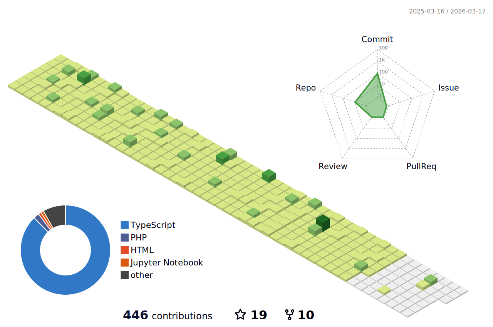

  

<h1 style="border:none" align="left">👋 Greetings! I'm Prashant Srivastav</h1>
<h2 style="border:none" align="left">🚀 Mobile & Full-Stack Developer | React Native • MERN • PHP • WordPress</h2>

## 👨‍💻 About Me

- ✨ Creating websites & apps since 2022
- 📚 Currently diving deeper into **Python** & **TypeScript**
- 🎯 Goal: Becoming a **proficient software developer** with expertise across **web & mobile platforms**
- 📍 Open to **remote opportunities & collaborations**

## 🛠️ Tech Stack & Tools

  
  
  
  
  
  
  
  
  
  
  
  
  
  

## 🌍 Languages

- 💬 English: ⭐⭐⭐⭐☆
- 💬 Hindi: ⭐⭐⭐⭐⭐

## 🔗 Connect With Me

  
  &nbsp;&nbsp;
  

## 📊 GitHub Stats & Activity

  
  

## 🏆 GitHub Trophies

## 🚀 Current Focus

🌱 Expanding expertise in **Shopify, GraphQL & advanced front-end performance**  
⚡ Actively looking for **remote roles & collaborations** in **React Native, MERN, and Shopify development**  
📖 Preparing for **industry-level problem-solving** with **DSA & system design basics**

  

