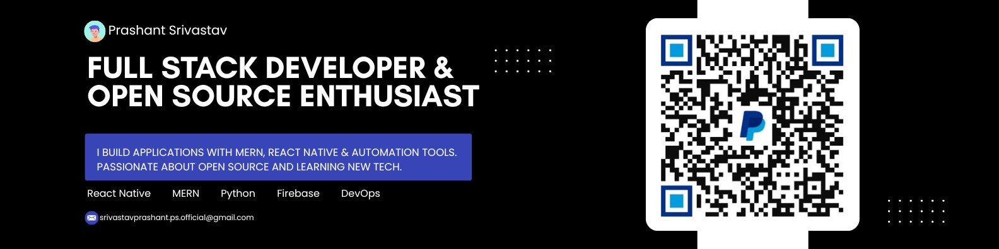

  

# 👋 Hi, I'm Prashant Srivastav

**Software Developer | Mobile & Web Applications | Founder – TechOrbitals**

I am a **software developer and freelancer** with hands-on experience building **real-world web, mobile, and Java-based applications**.
I work across **frontend, backend, mobile, and desktop software**, with a strong focus on **clean architecture, usability, and complete delivery**.

📍 Lucknow, India
🌍 Open to Remote | Hybrid | Freelance | Full-Time

---

## 👨‍💻 About Me

🎓 MCA (Pursuing) | BCA Graduate   🏗️ Founder of **TechOrbitals** – Freelance Development Agency   📱 Built & published mobile apps using **React Native + Expo**   🌐 Delivered business websites, dashboards & admin panels   🧠 Strong foundation in **Java, OOP, databases, and system-level logic**   📄 Published research paper in an international journal

> I focus on **learning by building**, solving real problems, and delivering complete solutions.

---

## 🧠 Core Skill Set

### 💻 Programming

- Java (Core Java, OOP, JDBC, MVC)
- JavaScript (ES6+), TypeScript (Basics)

### 🌐 Web Development

- React.js, Next.js
- HTML5, CSS3, Tailwind CSS, Bootstrap
- MERN Stack (MongoDB, Express, Node.js)

### 📱 Mobile Development

- React Native (Expo)
- Android (Java – Activities, Services, Intents)

### 🗄️ Databases & Storage

- MySQL
- MongoDB
- Firebase
- SQLite

### 🛠️ Tools & Deployment

- Git & GitHub
- Vercel, Netlify
- Android Studio, VS Code
- Postman

---

## 📄 Publication

### 🧪 DrDoc – Face Authentication Based Healthcare Portal

**Published in:** _International Journal of Scientific Research in Engineering and Management (IJSREM)_

- Secure login using face authentication
- Role-based access & encrypted data handling
- Real-world MERN stack implementation

📄 [View Paper](https://drive.google.com/file/d/1WPasMuxKAfe4U4Lqet-zZYnhYvAQvkgr/view)
📜 [Certificate](https://drive.google.com/file/d/1VPWV2uJvspSwY1Zycoxulc-n0K2h9Av7/view)

---

## 🧾 Certifications

**Java Software Development – Analyze Infotech**

- Built Movie Ticket Booking System (Java + MySQL)
- Covered OOP, JDBC, MVC, file handling

---

## 💼 Services Offered (Freelance)

📱 Mobile App Development (React Native – Android)  
🌐 Website Development (React / Next.js)  
🧩 Dashboards & Admin Panels  
⚙️ Backend APIs & Database Integration  
🚀 Deployment (Vercel, APK builds, domains)  

## 🌍 Availability

**Available for:**

- Internship
- Full-Time
- Freelance / Contract
- Remote or Hybrid (Lucknow)

---

## 🔗 Connect With Me

- 🌐 Portfolio: [https://prashant.techorbitals.in](https://prashant.techorbitals.in)
- 🏢 Agency: [https://techorbitals.in](https://techorbitals.in)
- 💼 LinkedIn: [https://linkedin.com/in/sangamprashantsrivastav](https://linkedin.com/in/sangamprashantsrivastav)
- 📧 Email: [srivastavprashant.ps.official@gmail.com](mailto:srivastavprashant.ps.official@gmail.com)
- 🐙 GitHub: [https://github.com/sangamprashant](https://github.com/sangamprashant)

---

## 🚀 Current Focus

🌱 Expanding expertise in **Shopify, GraphQL & advanced front-end performance**  
⚡ Actively looking for **remote roles & collaborations** in **React Native, MERN, and Shopify development**  
📖 Preparing for **industry-level problem-solving** with **DSA & system design basics**

<!-- 

  

 -->

  

<picture>
  <source media="(prefers-color-scheme: dark)" srcset="https://raw.githubusercontent.com/sangamprashant/sangamprashant/output/pacman-contribution-graph-dark.svg">
  <source media="(prefers-color-scheme: light)" srcset="https://raw.githubusercontent.com/sangamprashant/sangamprashant/output/pacman-contribution-graph.svg">
  
</picture>

---

## 💖 Support My Work

If you find my projects, tools, or content helpful and would like to support my work, you can contribute via PayPal.
Your support helps me maintain open-source projects and build more useful software 🚀

  

### 👉 **[Support me on PayPal — @sangamprashant](https://paypal.me/sangamprashant)**

---
